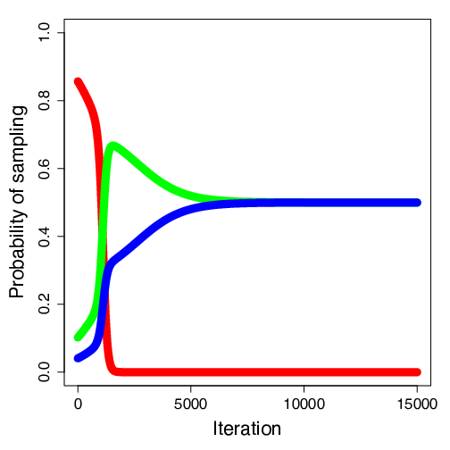
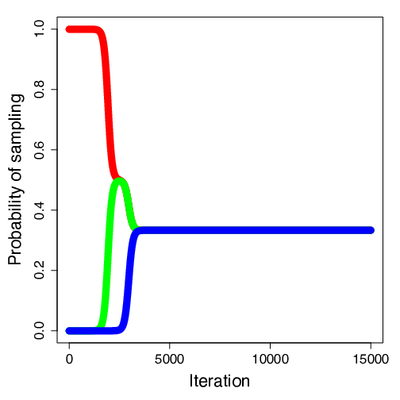
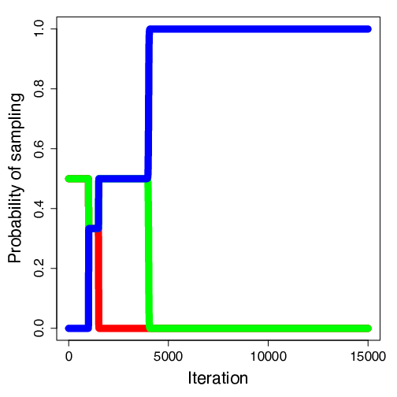
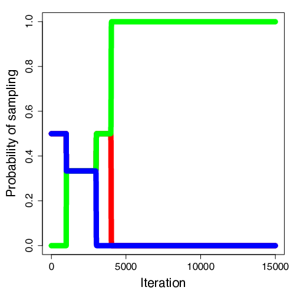
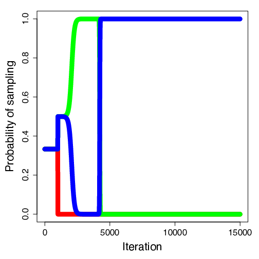

<h1 align="center">SNDProb</h1>
<h3 align="center">Streaming novelty detection framework for large data stream classification.</h3>

<p align="center">
  
  
  
  
  
</p>


<p align="center">
  
</p>

SNDProb provides a Streaming Novelty Detection framework for data stream classification. A Gaussian mixture model is used to model the set of classes. An initial model is learned from a fully labeled dataset. Instances arrive in a stream fashion, one at a time and not necessarily in equal spaced time intervals. SNDProb classifies the newcomer instances among the learned classes based on a probability threshold. When there is no enough evidence to classify an instance among the known classes, it is introduced in a fixed size buffer. When the buffer is full, new classes are sought in this buffer. The Expectation Maximization (EM) algorithm is used to update the current model and discover emerging new classes.


It is a free R code that is under [MIT License](https://github.com/andercarreno/SNDProb/blob/master/LICENSE).

--------

## Usage
The SNDProb framework has 2 main code files. ```SNDProb.R```contains the functions of the SNDProb such as how to learn the initial offline model, predict newcomer instances or discover new classes. ```SNDProbRun.R``` is the main program to run the SNDProb.

In order to simplify the usage of the application for testing purposes. A simple [web application](https://andercarreno.shinyapps.io/SNDProb) has been developed that allows the user to run the experiments explained in the paper.

--------

## Data
The experimental data can be found under the data folder of this repository. The generator functions are under the dataGenerators folder.

In the ```dataGenerators/Scenarios.R``` the arrival strategies can be found.

### Arrival Strategies
|  |   |   |
|---|---|---|
|   |   |   |

In order to control the arrival rate of different instances, 6 different _arrival strategies_ have been created. An _arrival strategy_ consists on a variety of exponential functions, one per class, that models the probability of sampling one of the classes at a certain timestamp.

The code that generates the _arrival strategies_ can be found in the ```dataGenerators/scenarios.R```.

### Scenarios
|  |   |   |
|---|---|---|
|   |   |   |

A battery of synthetic datasets has been generated to test a variety of realistic situations, and have a fine control over a set of different characteristics. The following aspects have been taken into account:

- the new class emergence timestamp,
- the probability of arrival of instances of new or known classes at each iteration of the stream,
- the overlap between the newcomer class and the existing ones, and
- the shape of the classes.


--------

## Contact
You can contact the author using the following email:
[Ander Carreño](mailto:andercarreno@ehu.eus?subject=[SNDProb]%20Information%20About%20Code)

[](https://github.com/andercarreno)
